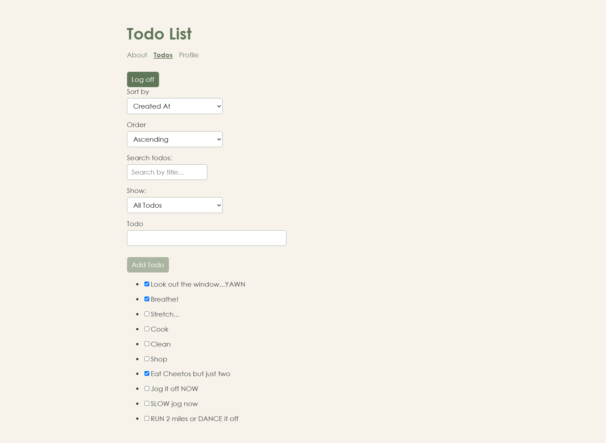
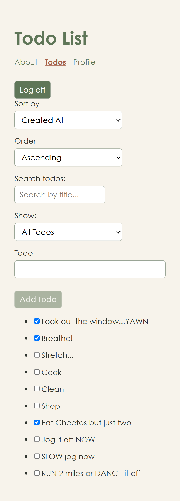

# Task List App
A visual task tracker designed for busy multitaskers who are easily distracted and want a simple way to stay focused, organized, and accountable throughout the day.
## Features
- User login and logout
- Protected Todo and Profile pages
- Add and edit tasks
- Mark tasks as completed or active
- Search tasks by title
- Sort tasks in ascending or descending order
- Filter tasks by all, active, or completed
- View task statistics on the Profile page
- Responsive layout for desktop and mobile
## Technologies
- React
- JavaScript
- Vite
- React Router
- HTML/JSX
- CSS
- Fetch API
- Git and GitHub
## Prerequisites
- Node.js
- npm
## Installation
1. Clone the repository.
2. Navigate to the project folder.
3. Install dependencies:
```bash
npm install
```
## Available Scripts
Start the Vite development server:
```bash
npm run dev
```

Create a production build:
```bash
npm run build
```

Preview the production build locally:
```bash
npm run preview
```
## Design Decisions
I chose sage green and warm terracotta because they are distinctive colors while still being calming, soothing, and attractive. The layout uses simple spacing and clearly organized controls to keep the task list easy to read and use.
## Future Improvements
- Add optional emojis and animated images to tasks to make the task list more expressive and fun.
## Contact
GitHub: vivienkhongcodes
## Screenshots 

### Desktop 


### Mobile 



## License
This project is licensed under the MIT License. See the [LICENSE](LICENSE) file for details.


